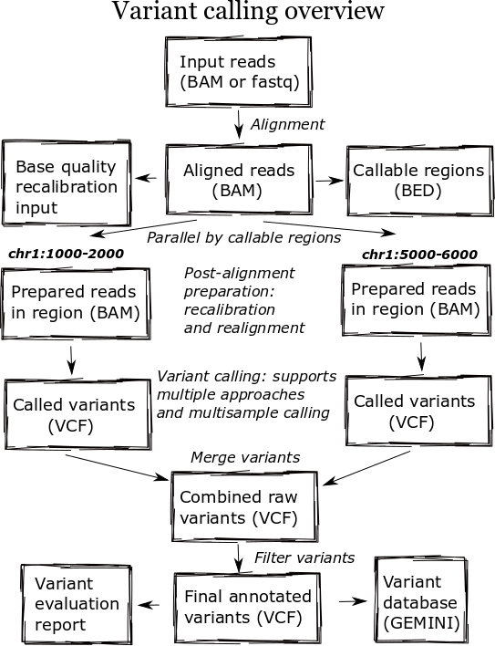
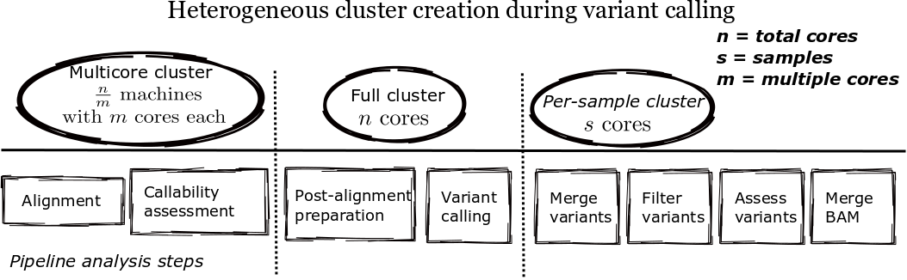

Internals
---------

Overview
~~~~~~~~

.. _internals-parallel:

Parallel
~~~~~~~~

bcbio calculates callable regions following alignment using `goleft depth
<https://github.com/brentp/goleft/tree/master/depth>`_. These regions determine
breakpoints for analysis, allowing `parallelization by genomic regions
<http://bcb.io/2013/05/22/scaling-variant-detection-pipelines-for-whole-genome-sequencing-analysis/>`_
during variant calling. Defining non-callable regions allows bcbio to select
breakpoints for parallelization within chromosomes where we won't accidentally
impact small variant detection. The callable regions also supplement the variant
calls to define positions where not called bases are homozygous reference,
as opposed to true no-calls with no evidence. The callable regions plus
variant calls is an alternative to gVCF output which explicitly enumerates
reference calls in the output variant file.

   Overview of cluster types during parallel execution
